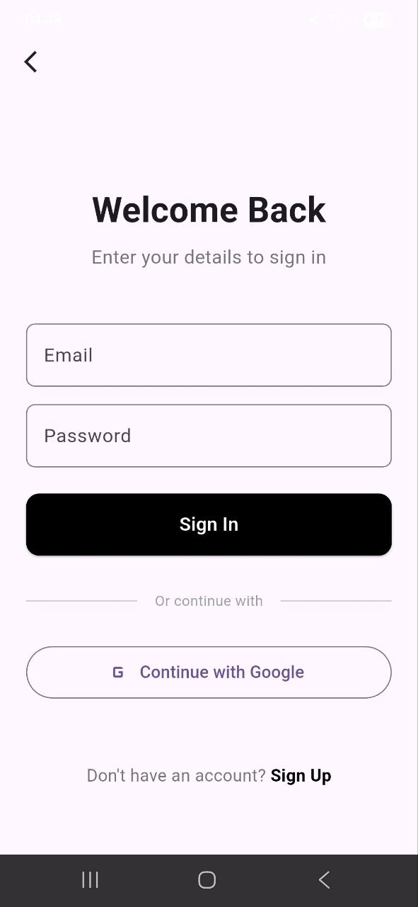
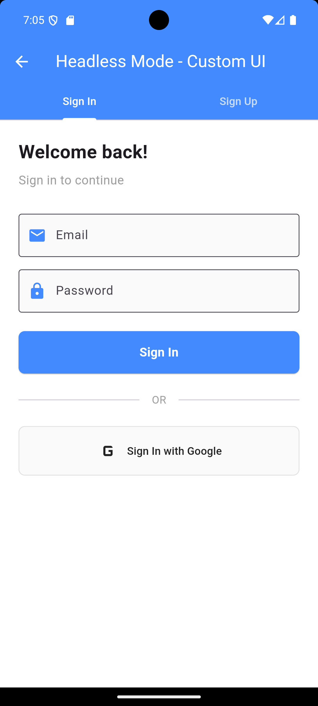
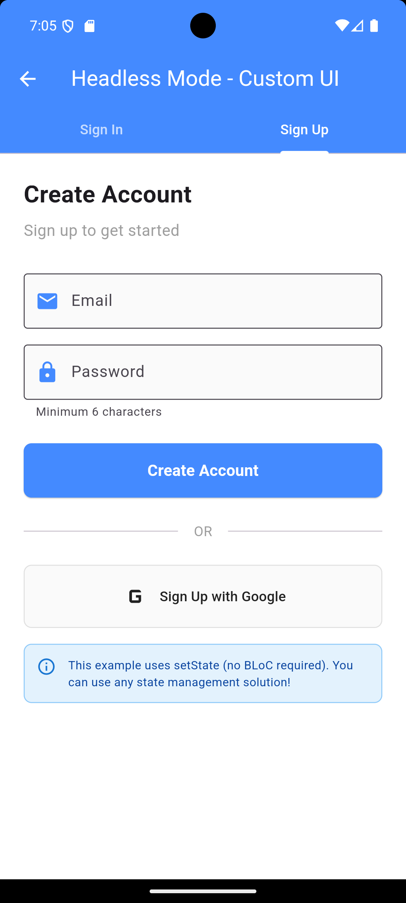
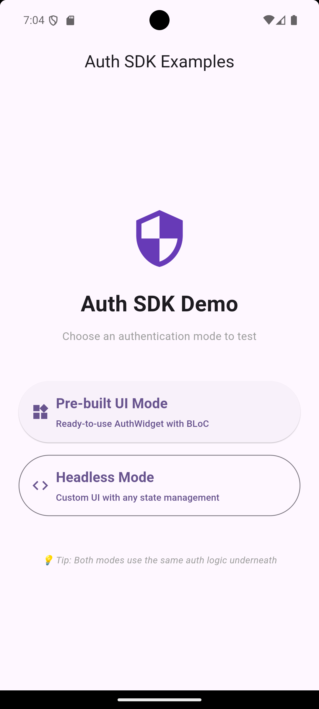

# Auth SDK

A flexible, Firebase-powered authentication SDK for Flutter that supports both **pre-built UI** and **headless (custom UI) modes**.

## 🌟 Features

- ✅ **Multiple Auth Providers**: Email/Password, Google Sign-In, (Apple Sign-In coming soon)
- ✅ **Dual Modes**: Pre-built UI widget or headless mode for complete customization
- ✅ **State Management Flexibility**: Use with BLoC, Provider, Riverpod, GetX, or plain setState
- ✅ **Automatic State Tracking**: Authenticated, Unauthenticated, TokenExpired, Loading, Error
- ✅ **Custom Exception Handling**: Clear, typed exceptions for all error scenarios
- ✅ **Configurable UI**: Enable/disable specific auth methods in pre-built UI
- ✅ **Stream-based**: Reactive auth state changes
- ✅ **Type-safe**: Full TypeScript-like null safety

## 📱 Screenshots
### Pre-built UI Mode
<table>
  <tr>
    <td></td>
  </tr>
  <tr>
    <td align="center">Sign In</td>
  </tr>
</table>
### Headless Mode (Custom UI)
<table>
  <tr>
    <td></td>
    <td></td>
    <td></td>
  </tr>
  <tr>
    <td align="center">Custom Login</td>
    <td align="center">Custom Sign Up</td>
    <td align="center">Mode Selection</td>
  </tr>
</table>

## 📦 Installation

Add this to your `pubspec.yaml`:

```yaml
dependencies:
  auth_sdk:
    path: ../auth_sdk  # Or your published package path
  firebase_core: ^4.2.1
  firebase_auth: ^6.1.2
  flutter_bloc: ^9.1.1  # Only needed if using pre-built UI mode
```

Then run:

```bash
flutter pub get
```

## 🚀 Quick Start

### 1. Initialize Firebase

```dart
void main() async {
  WidgetsFlutterBinding.ensureInitialized();
  await Firebase.initializeApp();
  runApp(MyApp());
}
```

### 2. Choose Your Mode

#### **Option A: Pre-built UI Mode** (Fastest Setup)

```dart
import 'package:auth_sdk/auth_sdk.dart';
import 'package:flutter_bloc/flutter_bloc.dart';

class MyApp extends StatelessWidget {
  @override
  Widget build(BuildContext context) {
    final authService = FirebaseAuthService();
    final authCubit = AuthCubit(authService);

    return BlocProvider<AuthCubit>(
      create: (_) => authCubit,
      child: MaterialApp(
        home: BlocBuilder<AuthCubit, AuthState>(
          builder: (context, state) {
            if (state.status == AuthStatus.authenticated) {
              return HomeScreen();
            }
            return AuthWidget(
              config: AuthConfig(
                enableEmail: true,
                enableGoogle: true,
                enableApple: false,
              ),
            );
          },
        ),
      ),
    );
  }
}
```

#### **Option B: Headless Mode** (Full Control)

```dart
import 'package:auth_sdk/auth_sdk.dart';

class CustomLoginScreen extends StatefulWidget {
  @override
  State<CustomLoginScreen> createState() => _CustomLoginScreenState();
}

class _CustomLoginScreenState extends State<CustomLoginScreen> {
  late final AuthRepository _authRepository;
  AuthUser? _currentUser;

  @override
  void initState() {
    super.initState();
    final authService = FirebaseAuthService();
    _authRepository = AuthRepository(authService);

    // Listen to auth state changes
    _authRepository.authStateStream.listen((user) {
      setState(() => _currentUser = user);
    });
  }

  Future<void> _signIn() async {
    try {
      await _authRepository.signInWithEmail(email, password);
    } on InvalidCredentialsException catch (e) {
      // Handle error
      print(e.message);
    }
  }

  @override
  Widget build(BuildContext context) {
    if (_currentUser != null) {
      return HomeScreen();
    }
    
    return Scaffold(
      body: YourCustomUI(onSignIn: _signIn),
    );
  }
}
```

## 📚 API Reference

### AuthRepository (Headless Mode)

#### Methods

| Method | Description | Throws |
|--------|-------------|--------|
| `signInWithEmail(email, password)` | Sign in with email/password | `InvalidCredentialsException`, `UserNotFoundException`, `NetworkException` |
| `signUpWithEmail(email, password)` | Create new account | `EmailAlreadyInUseException`, `WeakPasswordException`, `NetworkException` |
| `signInWithGoogle()` | Sign in with Google | `NetworkException` |
| `signOut()` | Sign out current user | - |
| `getIdToken({refresh})` | Get user's ID token | `TokenExpiredException` |

#### Streams

| Stream | Type | Description |
|--------|------|-------------|
| `authStateStream` | `Stream<AuthUser?>` | Emits current auth user or null |

### AuthCubit (UI Mode)

#### Methods

| Method | Description |
|--------|-------------|
| `signInWithEmail(email, password)` | Sign in with email/password |
| `signUpWithEmail(email, password)` | Create new account |
| `signInWithGoogle()` | Sign in with Google |
| `signOut()` | Sign out current user |

#### States

```dart
enum AuthStatus {
  authenticated,    // User is logged in
  unauthenticated, // User is logged out
  loading,         // Auth operation in progress
  error,           // An error occurred
  tokenExpired,    // User's session expired
}
```

### AuthConfig

Configure which auth methods to show in pre-built UI:

```dart
// All methods enabled
AuthConfig.defaultConfig

// Email only
AuthConfig.emailOnly

// Social only (Google + Apple)
AuthConfig.socialOnly

// Custom configuration
AuthConfig(
  enableEmail: true,
  enableGoogle: true,
  enableApple: false,
)
```

## ❌ Error Handling

The SDK provides typed exceptions for clear error handling:

| Exception | Code | Description |
|-----------|------|-------------|
| `InvalidCredentialsException` | `invalid-credentials` | Wrong email/password combination |
| `UserNotFoundException` | `user-not-found` | Account doesn't exist |
| `EmailAlreadyInUseException` | `email-in-use` | Email already registered |
| `WeakPasswordException` | `password-not-strong` | Password doesn't meet requirements |
| `TokenExpiredException` | `token-expired` | User's session expired |
| `NetworkException` | `network-error` | Network connectivity issue |

### Example Error Handling

```dart
try {
  await authRepository.signInWithEmail(email, password);
} on InvalidCredentialsException catch (e) {
  showError('Wrong email or password');
} on UserNotFoundException catch (e) {
  showError('Account not found');
} on NetworkException catch (e) {
  showError('Check your internet connection');
} catch (e) {
  showError('An unexpected error occurred');
}
```

## 🎨 UI Customization (Pre-built Widget)

The `AuthWidget` provides a clean, Material Design interface. Customize it using:

```dart
AuthWidget(
  config: AuthConfig(
    enableEmail: true,
    enableGoogle: true,
    enableApple: false,
  ),
)
```

## 🔧 Advanced Usage

### Custom AuthService Implementation

You can implement your own auth backend:

```dart
class CustomAuthService implements AuthService {
  @override
  Stream<AuthUser?> authStateChanges() {
    // Your implementation
  }

  @override
  Future<AuthUser?> signInWithEmail(String email, String password) async {
    // Your custom backend logic
  }

  // Implement other methods...
}

// Use it
final customService = CustomAuthService();
final authRepository = AuthRepository(customService);
```

### Token Management

```dart
// Get current user's ID token
final token = await authRepository.getIdToken();

// Force token refresh
final freshToken = await authRepository.getIdToken(refresh: true);

// Use token for API calls
final response = await http.get(
  apiUrl,
  headers: {'Authorization': 'Bearer $token'},
);
```

## 📱 Platform Setup

### Android

1. Add `google-services.json` to `android/app/`
2. Update `android/build.gradle`:
   ```gradle
   dependencies {
     classpath 'com.google.gms:google-services:4.4.0'
   }
   ```
3. Update `android/app/build.gradle`:
   ```gradle
   apply plugin: 'com.google.gms.google-services'
   
   defaultConfig {
     minSdk 23  // Required for Firebase Auth
   }
   ```

### iOS

1. Add `GoogleService-Info.plist` to `ios/Runner/`
2. Update `Info.plist` for Google Sign-In:
   ```xml
   <key>CFBundleURLTypes</key>
   <array>
     <dict>
       <key>CFBundleURLSchemes</key>
       <array>
         <string>YOUR_REVERSED_CLIENT_ID</string>
       </array>
     </dict>
   </array>
   ```

## 📖 Example App

Check the `/example` folder for complete implementations of both modes:

- **UI Mode**: Using `AuthWidget` with BLoC
- **Headless Mode**: Custom UI with `setState`

Run the example:

```bash
cd example
flutter run
```

## 🤝 Contributing

Contributions are welcome! Please feel free to submit a Pull Request.

## 📄 License

This project is licensed under the MIT License.

## 👥 Authors

Onojefemue Oghenemine Emmanuel (EmmanuelO)

## 🐛 Issues & Support

For issues, feature requests, or questions, please file an issue on GitHub.

---

**Made with ❤️ for the Flutter community**
